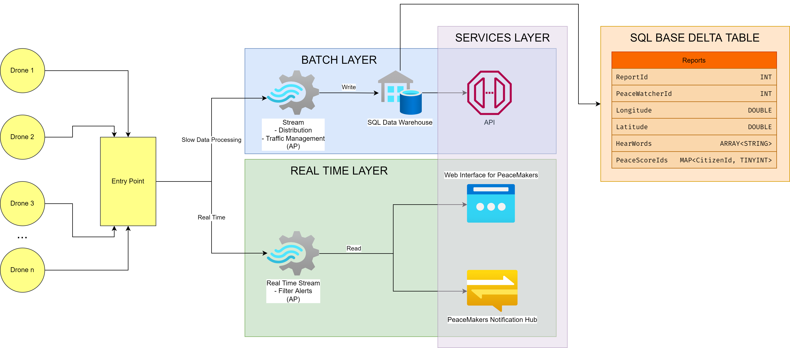

###### tags: `SPARK` `Projet`

# Synthèse des consignes

👉 [Le sujet du projet](https://docs.google.com/document/d/1HhRYSRrJ0bu8Qb4HncIYzhKcCU-pHknSEd40RgFnJis/edit)

## Objectif de l'architecture Big Data
* Stocker les données de chaque PeaceWatcher
* Déclencher des alertes
* Permettre aux PeaceMakers d'analyser les données des PeaceWatchers

## Drones
* Un rapport chaque minute
    * Id du PeaceWatcher
    * Location du PeaceWatcher (latitude, longitude)
    * Nom des citoyens à proximité avec leur *PeaceScore* du moment
    * Liste des mots entendus par le PeaceWatcher

## Alerte
* Générées le plus vite possible
    * Location du PeaceWatcher (latitude, longitude)
    * Nom du citoyen qui l'a déclenché.

## Statistiques
* Toutes les données doivent être conservées
* ~200Gb de données générées par jour
* < 1% d'alertes parmi les rapports

## Questions
1. Quelles sont les contraintes techniques/business auxquelles le composant de stockage de données de l'architecture du programme doit répondre pour satisfaire le besoin décrit par le client dans le paragraphe "Statistiques" ? 
De quel(s) type(s) de composant(s) (listés dans le cours) l'architecture aura-t-elle besoin ?
2. Quelle contrainte métier l'architecture doit-elle satisfaire pour répondre à l'exigence décrite dans le paragraphe "Alerte" ? Quel composant choisir ?
3. Quelle(s) erreur(s) de Peaceland peut expliquer la tentative ratée ?
4. Peaceland a probablement oublié certaines informations techniques dans le rapport envoyé par le drone. À l'avenir, cette information pourrait aider Peaceland à rendre ses observateurs de la paix beaucoup plus efficaces. Quelles informations ?

## Question 1

> Avons-nous vraiment besoin du Big Data pour ce problème?

Étant donné les remarques ci-dessous :
* La grande quantité de données à stocker (en un an, environ 365 * 200Gb = 73Tb de données stockées)
* Un accès rapide à ces données (tout particulièrement pour les alertes)
* Différents types de données
    * Chaine de caractère : Nom
    * Float : Longitude, latitude, PeaceScore
    * Liste de chaine de caractère : Mots entendus

On en déduit qu'une architecture de type Big Data est nécessaire à ce projet.

> Quelles priorités choisir parmi les trois du théorème CAP?

Analysons chaque composante CAP d'après la situation décrite dans le sujet :
* **Consistance (C)** : Elle n'est utile uniquement que dans l'éventualité où les drones seraient amenés à coordonner leurs mouvements entre eux.
* **Disponibilité (A)** : Elle est importante dans tous les cas. En effet, si le système ne réagissait plus suffisamment rapidement, les rapports des drones auraient tendance à s'accumuler avant d'être traités. On peut cependant supposer que certaines périodes (la nuit notamment) sont propices à une diminution du nombre de requêtes, et que le faible nombre de données générées par chaque drone indépendamment peut être stocké dans l'appareil en attendant d'être traité.
* **Résistance aux pannes (P)** : Elle est indispensable au projet, car le système d'alerte doit toujours être opérationnel dans une certaine mesure.

On déduit de l'analyse qu'il faudrait s'orienter vers une architecture *CP* ou *AP* afin de respecter les demandes. Nous allons néanmoins préférer l'architecture *AP*  parce qu'il ne nous est pas demandé de gérer la communication des drones entre eux, ce qui nous permet de négliger la consistance.

> Vers quel type de base de données faut-il s'orienter?

Tout dépend du besoin des Data-scientistes. 

Si on voulait :
* avoir un accès rapide à tout moment à certains rapports spécifique 
* aider notre équipe de scientifiques à se sentir à l'aise (habitué à traiter avec des bases de données SQL)

Alors une base de données clé-valeur orientée ligne de type SQL est parfaite. Mais ce type de base de données est difficilement scalable horizontalement et ce n'est pas très optimisé si l'on veut faire de l'analyse de données en fin de compte.

L'analyse de données effectuée par les PeaceMaker consiste essentiellement à récupérer l'ensemble des valeurs d'une colonne pour en faire des statistiques (moyenne, écart-type, ...). Cette analyse est faite ponctuellement, on peut imaginer ça chaque soir. On n'a donc pas forcément besoin d'un accès rapide immédiat à la donnée. On remarque ainsi que l'approche clé-valeur pour une base de données orientée ligne n'est pas forcément adaptée à notre cas d'usage.

Pour ce faire, il faudrait plutôt utiliser une base de données No-SQL orientée colonne. Ce type de base de données est parfaitement adapté pour faire de l'analyse de données issues de capteurs d'objet connectés (typiquement ce qui est fait avec les drones). L'entité est scalable sur plusieurs machines. Finalement, en utilisant ce type de base de données, on se repose sur les propriétés de type BASE, avec une donnée qui est forcément Disponible (A) et Distribuée (P). C'est exactement ce que l'on veut !

**Reports :**
| ReportId  | PeaceWatcherId | Longitude | Latitude | Time     | HeardWords    | PeaceScores             |
| --------- | -------------- | --------- | -------- | -------- | ------------- | ----------------------- |
| INT       | INT            | DOUBLE    | DOUBLE   | DATETIME | ARRAY<STRING> | MAP<CitizenId, TINYINT> |

⚠️ Cependant, il ne faut surtout pas utiliser de Data Lake, étant donné que les données sont structurées et ne sont pas assez grosses et variées pour justifier d'une telle technologie. Un Data Lake est davantage orientée pour les données non structurées ou partiellement structurées.

> Batch ou Stream?

Étant donné la quantité de données relativement faible à traiter (3600 * 200Gb / 24 ~ 2Mb par seconde) et la quasi-absence de traitement à effectuer, un stream est préférable pour maximiser la vitesse de traitement des alertes.
Une solution alternative consisterait à utiliser un stream pour filtrer les alertes et les traiter avec un système spécifiques tandis que les rapports pourraient passer par un Map-Reduce pour traiter les données afin de favoriser leur stockage.

Étapes que suivraient les données :
* chiffrement éventuel,
* compression
* (déchiffrage et extraction de données,
* création de nouvelles caractéristiques à partir des données existantes...)

Ainsi, ce problème a des contraintes qui nécessitent l'appel aux technologies du Big Data :
* Une quantité considérable de données à traiter
* Un traitement rapide de ces données
* Une disponibilité et une résistance aux pannes maximales

Pour répondre à ces problématiques, nous devrions faire appel aux composants suivants :
* *Source de données* : Drones (éventuellement un protocole et un réseau d'antennes privées ou via la 5G pour une vitesse optimale)
* *Stockage* : Base de données BASE modèle clé-valeur orientée par ligne
* *Stream Processing* : pour filtrer les alertes à traiter le plus rapidement possible et les rapports standards.
* *Batch Processing* : Pour le traitement des rapports et l'optimisation de leur stockage.

## Question 2

> Quelle contrainte métier l’architecture doit-elle satisfaire pour répondre à l’exigence décrite dans le paragraphe “Alerte” ? Quel composant choisir ?

Le traitement des alertes nécessite les contraintes métier suivantes :
* **Capacité**
    * Les PeaceMakers devraient pouvoir indiquer leur disponibilité pour une éventuelle intervention.
    * La gestion des alertes devrait être répartie de manière optimale entre les différents PeaceMaker.
    * Les PeaceMakers pourraient se voir attribuer des alertes différentes en fonction de leurs compétences.
* **Nombre**
    * La gestion des alertes devrait prendre en compte le nombre de PeaceMaker total et disponible.
* **Ajustement des coûts**
    * Les alertes devraient être réparties entre les différents PeaceMakers en fonction des éventuels coûts d'intervention.

Pour répondre à ces exigences, nous pourrions faire usage des composants suivants

* Pour communiquer rapidement les alertes, nous devrions faire appel à un **stream** pour les traiter dans l'ordre de leur arrivée.
* Pour transmettre les alertes au PeaceMakers, une interface Web devrait être mise en place. Nous pourrions faire appel à un serveur Apache pour ce faire.

## Question 3

> Quelle(s) erreur(s) de Peaceland peut expliquer la tentative ratée ?

Le cahier des charges de Peaceland est très compréhensible, mais manque de précision sur certains points qui peuvent expliquer l'échec de l'équipe de Data-Scientist:
1. Le budget disponible n'est pas clairement précisé
    
    On pourrait tenter d'atteindre les nécessités du cahier des charges en minimisant au maximum le coût de mise en place et d'entretien, mais certaines nécessités sont assez floues. *Exemple* : "Les alertes doivent être déclenchées le **plus vite possible**". On aurait préféré *"Une alerte doit pouvoir être traitée en 1 seconde."*

2. Il ne nous est pas détaillé si les alertes sont générées en même temps que les rapports ou constituent un service à part entière.
    
    On va admettre que les alertes peuvent être déclenchées à n'importe quel moment et ne sont pas nécessairement attachées à un rapport.

3. Nous n'avons pas d'information quant au nombre de citoyens et de drones et à leurs habitudes. Il nous est ainsi difficile d'estimer les variations du nombre de requêtes au cours de la journée et les marges que nous devrions anticiper.

    Nous supposerons que notre architecture dispose des marges requises. (Surcharge éventuelle de requête en journée ou dans certains lieux, absence de requête pendant la nuit...)

4. La confidentialité des utilisateurs et le caractère privé des informations enregistrées ne nous permet pas de savoir si l'usage de composants du cloud est envisageable ou si toute l'architecture doit être recréée à la main.

    Dans le doute, nous ne ferons pas appel à des composants échappant au contrôle de PeaceLand.

5. Le cahier des charges ne le précise pas, mais on peut supposer qu'il est important de prévoir une interface permettant de facilement vérifier l'état des différents composants du système pour pouvoir réagir en cas de panne.
  
## Question 4

> Quelles informations, oubliées dans le rapport du drone, pourraient augmenter l'efficacité des observateurs de Peaceland ?

Le rapport contient déjà :
* L'ID du PeaceWatcher
* Sa position (longitude, latitude)
* Le nom des personnes observées ainsi que leur PeaceScore actuel
* La liste de mots entendus

Pour augmenter l'efficacité des observateurs, on pourrait :

1. Permettre aux PeaceMakers d'anticiper les lieux d'intervention. Il suffirait alors de se rapprocher de ces lieux puisque la moyenne de PeaceScore ainsi que son évolution (c'est-à-dire sa dérivée) seraient ajoutées au rapport. De ce fait, il serait possible d'anticiper les mouvements de foule ou autres paniques générales. En effet, le PeaceScore d'un individu est souvent influencé par le score de ses voisins, connaitre la moyenne d'une zone permettrait d'agir en conséquence.

2. Détecter les émotions exprimées par les individus. En utilisant un système embarqué de reconnaissance d'expressions du visage et d'émotions dans la voix, on pourrait permettre aux PeaceWatcher d'avoir une information essentielle à la détection de la haine. Tout ne s'exprime pas que par des mots. Par conséquent, permettre aux drones de pouvoir lire sur les visages et écouter l'intonation de la voix faciliteraient grandement le travail de maintien de la paix : un individu avec un visage triste ou une voix traduisant une colère profonde et une frustration à peine cachée se verrait invité dans un camp de la paix.

# Architecture

